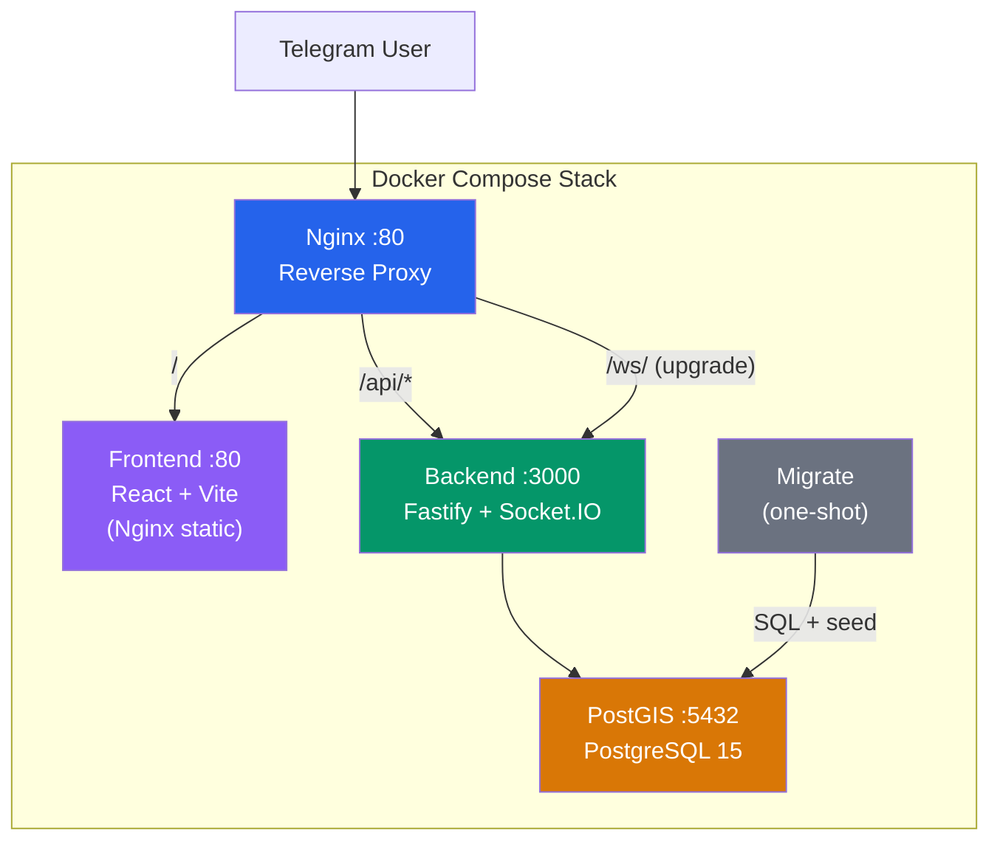

# Cyprus Geo-Social TMA

> Interactive map of Cyprus with community chat — Telegram Mini App

## Architecture



## Quick Start

### Prerequisites
- [Docker](https://docs.docker.com/get-docker/) & Docker Compose v2
- A [Mapbox](https://account.mapbox.com/) access token (free tier)
- (Optional) A Telegram Bot token from [@BotFather](https://t.me/BotFather)

### 1. Clone & Configure

```bash
git clone <repo-url> cyprus-geo-tma
cd cyprus-geo-tma

# Edit .env — set your tokens
cp .env .env.local  # optional backup
```

Edit `.env`:
```env
POSTGRES_PASSWORD=your_secure_password
TELEGRAM_BOT_TOKEN=123456:ABC-DEF...
VITE_MAPBOX_TOKEN=pk.eyJ1...
```

### 2. Launch

```bash
docker compose up -d --build
```

This will:
1. Start PostGIS database
2. Run migrations (4 SQL files) + seed 12,815 places from GeoJSON
3. Start the Fastify backend (REST + WebSocket)
4. Build and serve the React frontend
5. Start Nginx reverse proxy on port 80

### 3. Verify

```bash
# Health check
curl http://localhost/healthz

# Places in Nicosia
curl "http://localhost/api/places?bbox=33.3,35.1,33.4,35.2" | jq .count

# Open in browser
open http://localhost
```

## Project Structure

```
cyprus-geo-tma/
├── docker-compose.yml          # Full stack orchestration
├── .env                        # Configuration (secrets)
├── data/
│   └── cyprus_places.geojson   # 12,815 places (Phase 1)
├── db/
│   ├── Dockerfile              # Migration runner image
│   ├── migrations/             # 4 SQL migrations
│   ├── seeds/seed_places.py    # GeoJSON → PostGIS importer
│   └── migrate.py              # Python migration runner
├── services/
│   ├── backend/                # Fastify 5 + Socket.IO 4
│   │   ├── Dockerfile
│   │   └── src/
│   └── frontend/               # React 19 + Vite 8 + Mapbox GL
│       ├── Dockerfile
│       └── src/
├── infra/
│   └── nginx/nginx.conf        # Reverse proxy + WebSocket
└── docs/
    ├── ARCHITECTURE.md          # DB schema, API contracts, WS events
    ├── DECISIONS.md             # ADR log (D1-D20+)
    ├── CHANGELOG.md             # Phase-by-phase history
    └── OPEN_QUESTIONS.md        # Known issues
```

## Development (without Docker)

```bash
# Terminal 1: Backend
cd services/backend
npm install
npm run dev            # http://localhost:3000

# Terminal 2: Frontend (with proxy to backend)
cd services/frontend
npm install
npm run dev            # http://localhost:5173
```

> The Vite dev server proxies `/api` and `/ws` to `localhost:3000`.

## Tech Stack

| Layer | Technology | Version |
|-------|-----------|---------|
| Database | PostgreSQL + PostGIS | 15 + 3.4 |
| Backend | Fastify + Socket.IO | 5 + 4 |
| Frontend | React + Vite | 19 + 8 |
| Map | Mapbox GL JS | 3 |
| State | Zustand | 5 |
| Animation | Framer Motion | 12 |
| CSS | Tailwind CSS | 4 |
| Proxy | Nginx | 1.27 |
| Container | Docker Compose | v2 |

## Troubleshooting

### Map is blank
Set a valid Mapbox token in `.env`:
```env
VITE_MAPBOX_TOKEN=pk.eyJ1...your_real_token
```
Then rebuild: `docker compose up -d --build frontend`

### Database connection refused
```bash
# Check if PostGIS is healthy
docker compose ps db

# View logs
docker compose logs db

# Force restart
docker compose restart db
```

### Migrations failed
```bash
# View migration logs
docker compose logs migrate

# Re-run migrations
docker compose run --rm migrate
```

### WebSocket not connecting
Ensure Nginx has the WebSocket upgrade headers. Check:
```bash
docker compose logs nginx
```
The `/ws/` location block must have `proxy_set_header Upgrade` and `Connection` headers.

### Port 80 already in use
Change the port in `.env`:
```env
APP_PORT=8080
```

## Phases

| # | Phase | Agent | Status |
|---|-------|-------|--------|
| 1 | Data Ingestion | Data Engineer | ✅ 12,815 places |
| 2 | Database Setup | DB Architect | ✅ PostGIS + seeds |
| 3 | Backend API | Backend Dev | ✅ REST + WebSocket |
| 4 | Frontend TMA | Frontend Dev | ✅ Map + Chat |
| 5 | Deployment | DevOps | ✅ Docker + Nginx |

## License

Private — Cyprus Geo-Social TMA Project
