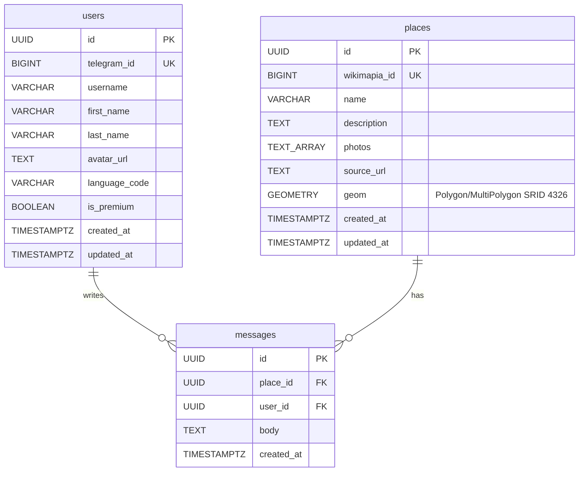
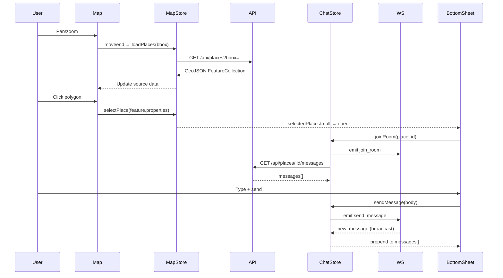
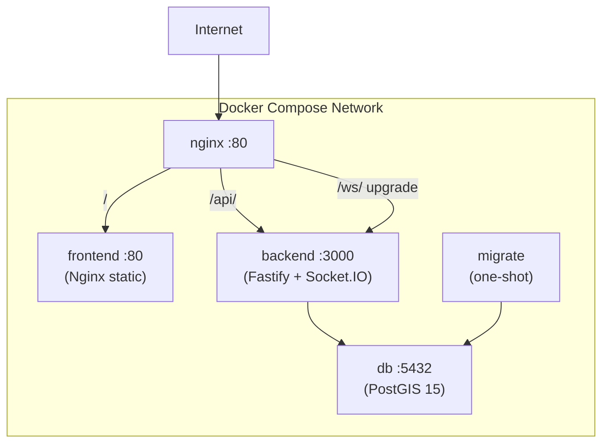

# ARCHITECTURE.md
> Single source of truth for DB schema, REST contracts, WebSocket events.
> Updated by every agent at the end of its phase.

## 1. Database Schema

### Engine
- **PostgreSQL 15** + **PostGIS 3.4**
- **SRID**: 4326 (WGS84)
- **Container**: `postgis/postgis:15-3.4`

### ER Diagram



### DDL

#### Table `users`
```sql
CREATE TABLE users (
    id            UUID PRIMARY KEY DEFAULT uuid_generate_v4(),
    telegram_id   BIGINT NOT NULL UNIQUE,
    username      VARCHAR(255),
    first_name    VARCHAR(255),
    last_name     VARCHAR(255),
    avatar_url    TEXT,
    language_code VARCHAR(10),
    is_premium    BOOLEAN NOT NULL DEFAULT FALSE,
    created_at    TIMESTAMPTZ NOT NULL DEFAULT NOW(),
    updated_at    TIMESTAMPTZ NOT NULL DEFAULT NOW()
);
```

#### Table `places`
```sql
CREATE TABLE places (
    id            UUID PRIMARY KEY DEFAULT uuid_generate_v4(),
    wikimapia_id  BIGINT UNIQUE,
    name          VARCHAR(512) NOT NULL,
    description   TEXT NOT NULL DEFAULT '',
    photos        TEXT[] NOT NULL DEFAULT '{}',
    source_url    TEXT NOT NULL DEFAULT '',
    geom          GEOMETRY(GEOMETRY, 4326) NOT NULL,
    created_at    TIMESTAMPTZ NOT NULL DEFAULT NOW(),
    updated_at    TIMESTAMPTZ NOT NULL DEFAULT NOW()
);
```

#### Table `messages`
```sql
CREATE TABLE messages (
    id            UUID PRIMARY KEY DEFAULT uuid_generate_v4(),
    place_id      UUID NOT NULL REFERENCES places(id) ON DELETE CASCADE,
    user_id       UUID NOT NULL REFERENCES users(id) ON DELETE CASCADE,
    body          TEXT NOT NULL,
    created_at    TIMESTAMPTZ NOT NULL DEFAULT NOW()
);
```

### Indexes

| Index | Type | Column(s) | Purpose |
|-------|------|-----------|---------|
| `idx_places_geom` | GiST | `places.geom` | Spatial queries (ST_Intersects, ST_DWithin) |
| `idx_places_wikimapia_id` | btree (partial) | `places.wikimapia_id` | UPSERT dedup during seeding |
| `idx_users_telegram_id` | btree | `users.telegram_id` | Auth lookup by Telegram ID |
| `idx_messages_place_created` | btree | `messages(place_id, created_at DESC)` | Chronological feed per place |
| `idx_messages_user_id` | btree | `messages.user_id` | "My messages" view |

### Spatial Query Examples

**Find all places inside a bounding box (map viewport):**
```sql
SELECT id, name, ST_AsGeoJSON(geom) AS geometry
FROM places
WHERE ST_Intersects(
    geom,
    ST_MakeEnvelope(33.3, 35.1, 33.4, 35.2, 4326)
);
```

**Find places within 500m of a point:**
```sql
SELECT id, name,
       ST_Distance(geom::geography, ST_SetSRID(ST_MakePoint(33.36, 35.17), 4326)::geography) AS distance_m
FROM places
WHERE ST_DWithin(
    geom::geography,
    ST_SetSRID(ST_MakePoint(33.36, 35.17), 4326)::geography,
    500
)
ORDER BY distance_m;
```

**Get place centroid and area:**
```sql
SELECT id, name,
       ST_AsGeoJSON(ST_Centroid(geom)) AS centroid,
       ST_Area(geom::geography) AS area_sq_m
FROM places
WHERE wikimapia_id = 1692697;
```

## 2. REST API Contracts

**Base URL**: `http://localhost:3000`
**Auth**: Telegram `initData` via `X-Telegram-Init-Data` header (for write endpoints)

### `GET /healthz`
Health check. No auth required.

**Response 200:**
```json
{
  "status": "ok",
  "db": "connected",
  "timestamp": "2026-04-25T18:22:25.958Z"
}
```

---

### `GET /api/places?bbox=minLon,minLat,maxLon,maxLat`
Find places within a bounding box. No auth required. Returns GeoJSON FeatureCollection.

**Query Parameters:**

| Param | Type | Required | Description |
|-------|------|----------|-------------|
| `bbox` | string | Yes | `minLon,minLat,maxLon,maxLat` (EPSG:4326) |

**Response 200:**
```json
{
  "type": "FeatureCollection",
  "bbox": [33.3, 35.1, 33.4, 35.2],
  "count": 500,
  "features": [
    {
      "type": "Feature",
      "geometry": {
        "type": "Polygon",
        "coordinates": [[[33.34, 35.16], [33.33, 35.16], [33.34, 35.16]]]
      },
      "properties": {
        "id": "a39a39c0-656b-4f8e-83ce-145137707ccd",
        "wikimapia_id": "8938710",
        "name": "Health and Social Aid Ministry",
        "description": "",
        "photos": [],
        "source_url": "http://wikimapia.org/8938710/",
        "created_at": "2026-04-25T18:11:18.192Z",
        "updated_at": "2026-04-25T18:11:43.114Z"
      }
    }
  ]
}
```

**Response 400:**
```json
{ "error": "Missing required query parameter: bbox", "example": "/api/places?bbox=33.3,35.1,33.4,35.2" }
```

**SQL used:** `ST_Intersects(geom, ST_MakeEnvelope($1,$2,$3,$4, 4326))`, hard limit 500 rows.

---

### `GET /api/places/:id/messages?cursor=<ISO>&limit=50`
Keyset-paginated messages for a place. No auth required. Newest first.

**Path Parameters:**

| Param | Type | Description |
|-------|------|-------------|
| `id` | UUID | Place ID |

**Query Parameters:**

| Param | Type | Default | Description |
|-------|------|---------|-------------|
| `cursor` | ISO 8601 | null | `created_at` of last seen message |
| `limit` | integer | 50 | 1..100 |

**Response 200:**
```json
{
  "messages": [
    {
      "id": "f47ac10b-58cc-4372-a567-0e02b2c3d479",
      "body": "Great place to visit!",
      "created_at": "2026-04-25T19:00:00.000Z",
      "user": {
        "id": "b2c3d479-...",
        "telegram_id": 123456789,
        "username": "john_doe",
        "first_name": "John",
        "last_name": "Doe",
        "avatar_url": null
      }
    }
  ],
  "next_cursor": "2026-04-25T18:59:00.000Z",
  "has_more": true,
  "count": 50
}
```

**SQL used:** keyset `WHERE place_id = $1 AND created_at < $2 ORDER BY created_at DESC`, uses composite index `idx_messages_place_created`.

## 3. WebSocket Events

**Transport**: Socket.IO 4.x
**Path**: `/ws/`
**Auth**: `initData` in handshake `auth.initData`

### Connection
```js
const socket = io("http://localhost:3000", {
  path: "/ws/",
  auth: { initData: window.Telegram.WebApp.initData }
});
```

### Client → Server Events

#### `join_room`
Subscribe to messages in a place.
```json
{ "place_id": "a39a39c0-656b-4f8e-83ce-145137707ccd" }
```

#### `leave_room`
Unsubscribe from a place.
```json
{ "place_id": "a39a39c0-656b-4f8e-83ce-145137707ccd" }
```

#### `send_message`
Post a new message. Requires auth. Max 2000 chars.
```json
{ "place_id": "a39a39c0-...", "body": "Hello from Nicosia!" }
```

### Server → Client Events

#### `new_message`
Broadcast to all room members when a message is posted.
```json
{
  "id": "f47ac10b-...",
  "place_id": "a39a39c0-...",
  "body": "Hello from Nicosia!",
  "created_at": "2026-04-25T19:00:00.000Z",
  "user": {
    "id": "b2c3d479-...",
    "telegram_id": 123456789,
    "username": "john_doe",
    "first_name": "John",
    "last_name": null
  }
}
```

#### `error`
Sent when a client action fails.
```json
{ "message": "Missing place_id or body" }
```

## 4. Frontend State & Routes

**Framework**: React 19 + Vite 8 (ESM)
**State**: Zustand (2 stores)
**Map**: Mapbox GL JS v3
**Real-time**: Socket.IO Client 4.x
**Animation**: Framer Motion 12

### File Structure
```
services/frontend/src/
├── main.jsx              # React root
├── App.jsx               # TMA init (ready, expand, theme)
├── index.css             # Tailwind v4 + Telegram theme vars + components
├── components/
│   ├── Map.jsx           # Mapbox GL: polygons, hover/active, moveend
│   └── BottomSheet.jsx   # Drag-to-dismiss chat panel (Framer Motion)
├── store/
│   ├── useMapStore.js    # places GeoJSON, selectedPlace, loadPlaces()
│   └── useChatStore.js   # messages[], joinRoom(), sendMessage(), loadMore()
└── lib/
    ├── api.js            # REST client (auto-attaches initData)
    └── socket.js         # Socket.IO singleton (WS auth via initData)
```

### Zustand Stores

#### `useMapStore`
| Field | Type | Description |
|-------|------|-------------|
| `places` | FeatureCollection | Current viewport GeoJSON |
| `selectedPlace` | object / null | Clicked polygon properties |
| `loading` | boolean | API loading state |
| `loadPlaces(bbox)` | action | Fetch `/api/places?bbox=` |
| `selectPlace(p)` | action | Open bottom sheet |
| `clearSelection()` | action | Close bottom sheet |

#### `useChatStore`
| Field | Type | Description |
|-------|------|-------------|
| `messages` | array | Messages for current room |
| `currentRoom` | string / null | Active place_id |
| `hasMore` | boolean | Keyset pagination flag |
| `nextCursor` | string / null | ISO timestamp cursor |
| `joinRoom(id)` | action | WS join + fetch messages |
| `leaveRoom()` | action | WS leave + clear state |
| `sendMessage(body)` | action | WS emit `send_message` |
| `loadMore()` | action | Fetch next page |

### Data Flow


## 5. Infrastructure Topology

**Orchestration**: Docker Compose v2
**Proxy**: Nginx 1.27-alpine
**Database**: postgis/postgis:15-3.4

### Service Diagram


### Services

| Service | Image | Internal Port | External Port | Healthcheck |
|---------|-------|--------------|---------------|-------------|
| `db` | postgis/postgis:15-3.4 | 5432 | 5432 | `pg_isready` |
| `migrate` | db/Dockerfile (Python 3.12) | — | — | one-shot |
| `backend` | services/backend/Dockerfile (Node 22) | 3000 | — | `wget /healthz` |
| `frontend` | services/frontend/Dockerfile (Nginx) | 80 | — | `wget /health` |
| `nginx` | nginx:1.27-alpine | 80 | `${APP_PORT:-80}` | — |

### Volumes
- `pgdata` — PostgreSQL data directory (persistent across restarts)
- `./data:/data:ro` — GeoJSON file mounted read-only into migrate container

### Nginx Routing

| Path | Upstream | WebSocket | Description |
|------|----------|-----------|-------------|
| `/` | frontend:80 | No | React SPA static files |
| `/api/*` | backend:3000 | No | REST API (Fastify) |
| `/healthz` | backend:3000 | No | Health check |
| `/ws/` | backend:3000 | **Yes** (Upgrade) | Socket.IO transport |

### Environment Variables

| Variable | Default | Used By | Description |
|----------|---------|---------|-------------|
| `POSTGRES_USER` | `cyprus` | db, migrate, backend | DB user |
| `POSTGRES_PASSWORD` | `cyprus_dev_2026` | db, migrate, backend | DB password |
| `POSTGRES_DB` | `cyprus_geo` | db, migrate, backend | DB name |
| `TELEGRAM_BOT_TOKEN` | — | backend | Telegram bot token for initData validation |
| `VITE_MAPBOX_TOKEN` | — | frontend (build-time) | Mapbox GL JS access token |
| `APP_PORT` | `80` | nginx | External port |
| `CORS_ORIGIN` | `*` | backend | CORS allowed origins |

## 6. Data Sources

### 6.1 Wikimapia (Phase 1)

**Source**: Wikimapia internal KML endpoint (`http://wikimapia.org/d?BBOX=`)

> **Note**: The official Wikimapia JSON API (`api.wikimapia.org`) with the `example` key is non-functional as of 2026. The scraper uses the internal KML endpoint that powers the Wikimapia web map, with cookie-based verification handling.

**Output**: `data/cyprus_places.geojson` — 12,815 features (EPSG:4326)

**GeoJSON → DB field mapping:**

| GeoJSON property | DB column | Type |
|-----------------|-----------|------|
| `wikimapia_id` | `places.wikimapia_id` | BIGINT |
| `name` | `places.name` | VARCHAR(512) |
| `description` | `places.description` | TEXT |
| `photos` | `places.photos` | TEXT[] |
| `url` | `places.source_url` | TEXT |
| `geometry` | `places.geom` | GEOMETRY(GEOMETRY, 4326) |
