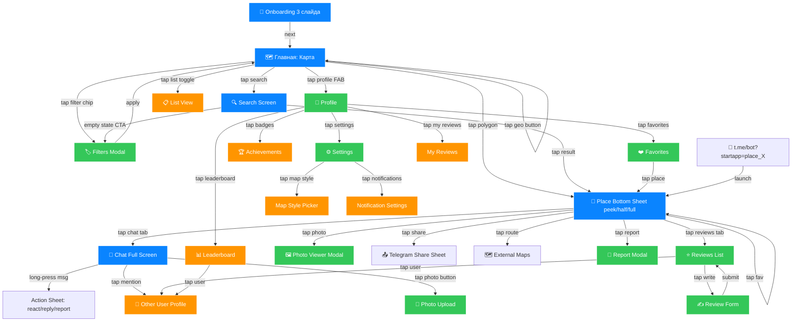

# Cyprus Geo-Social TMA — Полная продуктовая и техническая спецификация

Это исчерпывающий документ для команды. Структура:
1. **Продуктовая стратегия** (персоны, конкуренты, монетизация, вирусность)
2. **Карта экранов** (все UI с wireframes + Mermaid-навигация)
3. **Компонентная библиотека** (дизайн-система)
4. **Функциональная спецификация** (P0/P1/P2)
5. **Глубокая техническая проработка P0** (TS-интерфейсы, SQL, API, код)
6. **Производительность 60 FPS** (конкретные техники)
7. **A/B-тесты и метрики**

---

## 1. Продуктовая стратегия

### 1.1 Целевые персоны

**🏖️ Persona 1: Турист-исследователь («Anna, 28, Берлин»)**
- 7 дней на Кипре, остановилась в Лимассоле, активна в Telegram-чатах путешественников
- **Боли**: Google Maps показывает только коммерческие POI, отзывы устаревшие, нет «живого» контекста («что тут происходит сейчас?»)
- **Хочет**: понять атмосферу места до посещения, спросить местных про скрытые жемчужины, найти где сейчас весело
- **Сценарий**: вечером открывает карту, видит «горящие» полигоны (бары, набережная), заходит в чат, спрашивает «есть ли live music сегодня?»

**🏛️ Persona 2: Местный житель («Andreas, 34, Никосия»)**
- Живёт на Кипре всю жизнь, эксперт района, любит Telegram-сообщества
- **Боли**: нет места обсудить «свой» район, в Google Maps ревью от туристов, а не от соседей
- **Хочет**: быть авторитетом, делиться знаниями, общаться по интересам с соседями
- **Сценарий**: в чате дома обсуждает с соседями ремонт лифта; в чате парка — собачников; зарабатывает бейджи «Local Expert»

**👨👩👧 Persona 3: Семья-экспат («Mark & Olya, 38, Пафос»)**
- Релокант из РФ, живёт год, ищет community
- **Боли**: фрагментированные Telegram-чаты, нет привязки к местам, сложно найти «своих»
- **Хочет**: найти места для детей, школы, спортзалы, познакомиться с соседями
- **Сценарий**: ищет «детские площадки в Пафосе» → видит карту с ревью других экспатов → пишет в чат площадки

**🍽️ Persona 4: Малый бизнес («Christos, 45, ресторатор Айя-Напа»)**
- Owner таверны на побережье
- **Боли**: реклама в Google дорогая, TripAdvisor токсичен, нет прямого канала к гостям
- **Хочет**: продвигать заведение, отвечать на отзывы, объявлять акции
- **Сценарий**: верифицирует место как owner → пушит акцию «happy hour» в чат своего полигона → видит её в feed окрестных пользователей

### 1.2 Конкуренты и Blue Ocean

| Продукт | Сильное | Слабое | Наше преимущество |
|---|---|---|---|
| Google Maps | Покрытие, навигация | Нет community, отзывы безличные | Real-time чаты, привязка к Telegram-identity |
| TripAdvisor | Отзывы туристов | Только коммерч. POI, нет местных | Все 12,815 объектов (включая жилые дома, парки) |
| Foursquare/Swarm | Геймификация | Мёртвая аудитория | Native Telegram-аудитория Кипра (~250K юзеров) |
| Telegram-чаты (типа «Кипр Инфо») | Активные | Не привязаны к местам, шум | Чаты по полигонам = микро-сообщества |
| Nextdoor | Соседская сеть | Нет на Кипре | Закрываем нишу до их экспансии |

**Blue Ocean позиционирование**: «Telegram + карта Кипра = живое сообщество мест». Не конкурируем с Google Maps по навигации, а создаём слой социального контекста поверх географии.

**УТП в одной фразе**: *«Зайди в чат любого места на Кипре — от Стены Зеноса до соседнего парка — и пообщайся с теми, кто там сейчас.»*

### 1.3 Воронка активации (North Star: D7 retention)

```
Install (через Telegram) → 100%
  ↓ (onboarding 2-3 экрана)
First map view → 85%
  ↓ (clic на «горящий» полигон)
First place card opened → 60%
  ↓ (видит активный чат, FOMO)
First message sent / read → 35%
  ↓ (push: «новый ответ в чате X»)
D1 return → 25%
  ↓ (ежедневный квест, серия)
D7 return → 15% [target]
  ↓
D30 return → 8% [target, ARPU начинает работать]
```

**Главный рычаг**: «горящие полигоны» в шаге 2 — пользователь ДОЛЖЕН увидеть жизнь на карте сразу.

### 1.4 Монетизация

**Фаза 1 (Months 1-3): Free MVP** — фокус на retention, 0 монетизации.

**Фаза 2 (Months 4-6): B2B Verified Places**
- Бизнес платит €19/мес или 500 Stars: верифицированный значок ✓, ответы owner-ом, аналитика, закреп акции в чате
- Target: 200 заведений × €19 = €3,800 MRR

**Фаза 3 (Months 7-12): Premium User + Promoted Pins**
- Premium €2.99/мес или 100 Stars/мес: расширенные фильтры, без рекламы, эксклюзивные бейджи, приоритетные уведомления
- Promoted polygons: €0.50 за 1000 показов в bbox-радиусе

**Unit-economics (Cyprus TAM)**:
- TAM: 1.2M резидентов + 3.9M туристов/год = ~5M потенциальных юзеров
- SAM (TG-юзеры на Кипре): ~280K
- SOM (12 мес): 50K MAU, 5K DAU
- ARPU блендед: €0.40/мес (mix free + premium + B2B)
- LTV: €4.80 (12 мес) на средний срок жизни
- CAC: €0 (Telegram-нативный шаринг) → €0.30 (paid в TG-каналах)
- LTV/CAC > 15 → жизнеспособная модель

### 1.5 Вирусные механики

1. **Telegram Share to Place** — каждое место имеет deep link `t.me/CyprusBot?startapp=place_<id>`. Клик в любом TG-чате открывает TMA сразу на этом месте.
2. **Quote-share сообщений** — кнопка «поделиться сообщением из чата места» в любой TG-чат как rich-preview карточкой.
3. **Streak**-мотивация — серия дней с активностью, ломается = нотификация → возврат.
4. **Referral**: «Пригласи 3 друзей, получи бейдж Pioneer» (через `WebApp.switchInlineQuery`).
5. **UGC-loop**: отзывы и фото → Google индексирует SEO-страницы (`/place/:slug`) → органика → новые юзеры.
6. **Live FOMO**: пуш «10 человек сейчас в чате @ Finikoudes Promenade» → click-through.

---

## 2. Карта экранов

### 2.1 Полная навигационная карта



Цвета: 🔵 P0 MVP / 🟢 P1 / 🟠 P2.

### 2.2 Wireframes ключевых экранов

#### 🗺️ Screen 1: Главная карта (P0)

```
┌──────────────────────────────────────┐
│ env(safe-area-inset-top) ≈ 44pt     │
├──────────────────────────────────────┤
│  ╭─────────────────────────────╮ ⓘ  │
│  │ 🔍 Поиск места...           │    │ ← Search pill (44pt,
│  ╰─────────────────────────────╯    │   glassmorphism blur 20px)
│                                      │
│  [ All ][🌳Парки][🍽️Еда][🛍️Магаз...] │ ← Category chips 32pt
│                                      │
│        🗺️ Mapbox Canvas              │
│      ✨ pulse on active polygon      │
│        (12 people in chat)           │
│                                      │
│                     ╭───╮            │
│                     │ 📍 │            │ ← Geo FAB 56pt
│                     ╰───╯            │
├──────────────────────────────────────┤
│  ╭───╮  ╭────────────╮  ╭───╮       │ ← Tab bar (translucent)
│  │ 🗺️ │  │ ❤️ Избран. │  │ 👤 │       │
│  ╰───╯  ╰────────────╯  ╰───╯       │
└──────────────────────────────────────┘
```

#### 📍 Screen 2: Place Bottom Sheet (P0) — 3 snap-points

```
PEEK (180pt):
┌──────────────────────────────────────┐
│        ── (drag handle 36×4pt)      │
│  Пляж Финикудес                  ✕  │
│  ★ 4.6 · 234 отзыва · 💬 12 онлайн   │
│  ╭───╮ ╭───╮ ╭───╮ ╭───╮ ╭───╮     │
│  │💬 │ │⭐ │ │🗺️ │ │📤 │ │❤ │     │
│  ╰───╯ ╰───╯ ╰───╯ ╰───╯ ╰───╯     │
└──────────────────────────────────────┘

HALF (50%):
+ Photo carousel 200pt
+ Description (3 lines, line-clamp)
+ [ Чат 12 ][ Отзывы ][ Инфо ] tabs

FULL (90%):
+ Selected tab content (chat/reviews/info)
+ Input bar (if chat tab)
```

#### 💬 Screen 3: Chat (P0)

```
┌──────────────────────────────────────┐
│ ← Пляж Финикудес            👥 12 ⓘ│
├──────────────────────────────────────┤
│ Andreas                              │
│ ╭─────────────────────╮              │
│ │ Привет всем! Кто на │ 14:23        │
│ │ пляже сегодня?      │              │
│ ╰─────────────────────╯              │
│ 👍 3   ❤️ 1                          │
│              ╭─────────────────────╮ │
│       14:25  │ Я тут, у синего    │ │
│              │ шезлонга 👋        │ │
│              ╰─────────────────────╯ │
│ Andreas is typing... ●●●            │
├──────────────────────────────────────┤
│ ╭─╮ ╭──────────────────────╮ ╭───╮ │
│ │📷│ │ Сообщение...          │ │ ➤ │ │
│ ╰─╯ ╰──────────────────────╯ ╰───╯ │
└──────────────────────────────────────┘
```

#### 🔍 Screen 4: Search (P0)

```
┌──────────────────────────────────────┐
│ ← ╭──────────────────────────╮  ✕   │
│   │ 🔍 Финикудес              │     │
│   ╰──────────────────────────╯     │
├──────────────────────────────────────┤
│ Недавнее                            │
│ 🕒 Пляж Маккензи               ✕   │
│ Категории                           │
│ [🌳 Парки][🍽️ Рест.][🛍️ Магаз.]    │
│ Результаты (при наборе)             │
│ ┌─────────────────────────────────┐ │
│ │ 📍 Пляж Финикудес              │ │
│ │ Ларнака · ★ 4.6 · 1.2 km       │ │
│ └─────────────────────────────────┘ │
└──────────────────────────────────────┘
```

---

## 3. Дизайн-система (токены)

```css
:root {
  /* Spacing (4-pt grid) */
  --s-1: 4pt; --s-2: 8pt; --s-3: 12pt; --s-4: 16pt;
  --s-6: 24pt; --s-8: 32pt; --s-10: 40pt; --s-12: 48pt;
  
  /* Typography (SF Pro / Inter / system) */
  --t-caption: 12pt/16pt; --t-footnote: 13pt/18pt;
  --t-body: 17pt/22pt; --t-headline: 17pt/22pt 600;
  --t-title2: 22pt/28pt 600; --t-title1: 28pt/34pt 700;
  
  /* Colors — Telegram aware */
  --bg: var(--tg-theme-bg-color, #fff);
  --bg-secondary: var(--tg-theme-secondary-bg-color, #F2F2F7);
  --text: var(--tg-theme-text-color, #000);
  --primary: var(--tg-theme-button-color, #0A84FF);
  --live: #FF2D55; /* Pulse for active polygons */
  
  /* Glass */
  --glass-bg: rgba(255,255,255,0.72);
  --glass-blur: blur(24px) saturate(180%);
  
  /* Motion */
  --ease-spring: cubic-bezier(0.34, 1.56, 0.64, 1);
  --dur-fast: 200ms; --dur-base: 280ms;
}
```

---

## 4. Функционал P0 → P1 → P2

### P0 (MVP, 2-3 недели)
- F1: Кластеризация + LOD (clusters → centroids → polygons по зуму)
- F2: Карточка места с фото, описанием, табами
- F3: Чат + оптимистичные сообщения + typing indicator
- F4: 🔴 «Живые» места — pulse/glow полигонов с активным чатом
- F5: Поиск (tsvector + trigram)
- F6: Telegram auth (уже есть)
- F7: Onboarding (3 слайда)
- F8: Deep links на места
- F9: Skeleton loaders + optimistic UI
- F10: Glass-стили

### P1 (недели 4-6)
- F11: Отзывы и рейтинги (1-5 звёзд)
- F12: Реакции на сообщения
- F13: Избранные (want/visited/loved)
- F14: Профиль + статистика
- F15: Загрузка фото (S3/R2 + pre-signed URL)
- F16: @mentions + push через бот
- F17: «Сейчас здесь» (opt-in presence)
- F18: Жалобы + автомодерация
- F19: Фильтры (категории, рейтинг, радиус)

### P2 (месяц 2+)
- F20-F22: Геймификация (бейджи, уровни, лидерборд, квесты)
- F23: Маршруты + режим «Прогулка»
- F24: Часы работы / контакты
- F25: События (events)
- F26-F28: B2B (verified owner, promoted polygons, premium подписка)
- F29: Telegram Bot уведомления
- F30-F32: Settings, List View, Inline шаринг

---

## 5. Техническая проработка P0

### 5.1 SQL-миграции

```sql
-- P0 enhancements
ALTER TABLE places
  ADD COLUMN IF NOT EXISTS centroid GEOGRAPHY(POINT, 4326)
    GENERATED ALWAYS AS (ST_Centroid(geom)::geography) STORED,
  ADD COLUMN IF NOT EXISTS category VARCHAR(40),
  ADD COLUMN IF NOT EXISTS search_tsv tsvector
    GENERATED ALWAYS AS (
      setweight(to_tsvector('simple', coalesce(name, '')), 'A') ||
      setweight(to_tsvector('simple', coalesce(description, '')), 'B')
    ) STORED;

CREATE INDEX idx_places_centroid ON places USING GIST (centroid);
CREATE INDEX idx_places_search ON places USING GIN (search_tsv);
CREATE EXTENSION IF NOT EXISTS pg_trgm;
CREATE INDEX idx_places_name_trgm ON places USING GIN (name gin_trgm_ops);

CREATE TABLE place_stats (
  place_id UUID PRIMARY KEY REFERENCES places(id) ON DELETE CASCADE,
  reviews_count INT NOT NULL DEFAULT 0,
  rating_avg NUMERIC(2,1),
  messages_count INT NOT NULL DEFAULT 0,
  photos_count INT NOT NULL DEFAULT 0,
  last_activity_at TIMESTAMPTZ,
  updated_at TIMESTAMPTZ NOT NULL DEFAULT NOW()
);

ALTER TABLE messages
  ADD COLUMN IF NOT EXISTS reply_to_id UUID REFERENCES messages(id),
  ADD COLUMN IF NOT EXISTS mentions BIGINT[] DEFAULT '{}';
```

### 5.2 WebSocket — Live Places

```typescript
// Client → Server
subscribe_live: { bbox: [minLon, minLat, maxLon, maxLat] }

// Server → Client
live_places_update: {
  added: [{ placeId: string, onlineCount: number }],
  changed: [{ placeId: string, onlineCount: number }],
  removed: string[]
}
```

### 5.3 Mapbox Pulse Layer

Интенсивность анимации зависит от `onlineCount`:
- 1-3: outline glow (line-blur: 4, opacity pulse 0.4↔0.8)
- 4-9: + circle ring на centroid
- 10+: + particle effect (WebGL custom layer)
