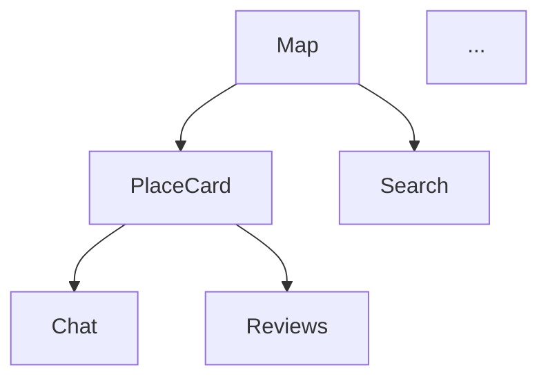

# Промпт для Genspark — Проектирование полного функционала

Скопируй всё ниже и вставь в Genspark:

---

Ты — продуктовый архитектор. Я строю **Cyprus Geo-Social TMA** — Telegram Mini App (WebApp), работающее внутри Telegram. Это интерактивная карта острова Кипр с гео-социальными функциями: пользователи видят места на карте, общаются в привязанных к местам чатах, оставляют отзывы и взаимодействуют друг с другом.

## Что уже готово (не нужно заново проектировать)

### База данных (PostgreSQL 15 + PostGIS 3.4)
- Таблица `places` — 12,815 полигонов (здания, парки, достопримечательности), загруженных с Wikimapia
  - Поля: `id` (UUID), `wikimapia_id`, `name`, `description`, `photos` (TEXT[]), `source_url`, `geom` (GEOMETRY), `created_at`, `updated_at`
  - GiST индекс на `geom` для быстрых пространственных запросов
- Таблица `users` — пользователи Telegram
  - Поля: `id` (UUID), `telegram_id` (BIGINT, unique), `username`, `first_name`, `last_name`, `avatar_url`, `created_at`
- Таблица `messages` — чат-сообщения привязанные к местам
  - Поля: `id` (UUID), `place_id` (FK → places), `user_id` (FK → users), `body` (TEXT, max 2000), `created_at`
  - Составной индекс `(place_id, created_at DESC)` для keyset-пагинации

### Backend (Fastify 5 + Socket.IO 4, Node.js)
- `GET /healthz` — healthcheck
- `GET /api/places?bbox=minLon,minLat,maxLon,maxLat` — поиск мест по bounding box, возвращает GeoJSON FeatureCollection (лимит 500)
- `GET /api/places/:id/messages?cursor=<ISO>&limit=50` — сообщения для места с keyset-пагинацией
- WebSocket (Socket.IO, path `/ws/`):
  - `join_room { place_id }` — подписаться на чат места
  - `leave_room { place_id }` — отписаться
  - `send_message { place_id, body }` → broadcast `new_message` всем в комнате
- Авторизация: Telegram `initData` HMAC-SHA256 валидация (header `X-Telegram-Init-Data`)
- Upsert пользователя при каждой авторизации

### Frontend (React 19 + Vite 8)
- Mapbox GL JS v3 — карта с полигонами, hover/active стили, обновление данных на `moveend`
- Bottom Sheet (Framer Motion) — шторка с чатом при клике на полигон
- Zustand — 2 стора: `useMapStore` (places, selectedPlace) и `useChatStore` (messages, rooms)
- Socket.IO Client — реал-тайм сообщения
- Tailwind CSS v4 + Telegram CSS-переменные (`--tg-theme-*`) для авто light/dark
- @twa-dev/sdk — `WebApp.ready()`, `expand()`, `colorScheme`

### Инфраструктура
- Docker Compose: db, migrate, backend, frontend, nginx
- Nginx reverse proxy с WebSocket upgrade (`/api/` → backend, `/ws/` → backend, `/` → frontend)

### Целевая аудитория
- Жители и туристы Кипра
- Пользователи Telegram (TMA работает внутри мессенджера)
- Возраст 18-45, мобильные пользователи (95%+ трафика с телефона)

## Твоя задача

Спроектируй **полный функционал** приложения, который сделает его по-настоящему полезным, вирусным и удерживающим пользователей. Продумай всё как будто это стартап с амбицией стать главным гео-приложением Кипра.

Для каждой фичи укажи:
1. **Название** и краткое описание
2. **Зачем** (какую проблему решает, влияние на retention/growth)
3. **UI/UX** — как это выглядит и как пользователь взаимодействует
4. **Новые API** — какие эндпоинты REST/WS нужно добавить
5. **Изменения в БД** — новые таблицы/колонки
6. **Приоритет**: P0 (MVP must-have), P1 (неделя 2-3), P2 (месяц 2+)

### Категории функционала, которые нужно проработать:

**Карта и навигация:**
- Кластеризация полигонов на дальних зумах
- Поиск мест (текстовый + по категориям)
- Категории мест (парки, рестораны, магазины, достопримечательности, жилые дома и т.д.)
- Фильтрация по категориям
- Мои избранные / закладки
- Ближайшие ко мне (геолокация)
- 🔴 **ВАЖНО: "Живые" места на карте** — полигоны, в которых прямо сейчас идёт активное обсуждение (есть пользователи в чате), должны визуально отличаться: светиться, пульсировать, иметь glow-эффект или анимированную обводку. Пользователь должен видеть на карте где сейчас "кипит жизнь" и хотеть зайти. Это ключевая фича для вовлечения — эффект FOMO ("там что-то происходит, я хочу посмотреть"). Продумай: backend WS-событие с количеством активных пользователей в комнате, визуальный стиль (pulse ring / glow / particle effect / animated border), интенсивность анимации в зависимости от количества людей.

**Социальные функции:**
- Профиль пользователя (аватар из Telegram, bio, статистика)
- Отзывы и рейтинги мест (1-5 звёзд + текст)
- Лайки/реакции на сообщения
- Упоминания пользователей (@username) в чате
- "Сейчас здесь" — показ активных пользователей на карте (opt-in)
- Фото-загрузки (пользовательские фото мест)

**Геймификация и вовлечение:**
- Система достижений / бейджей (первый отзыв, посетил 10 мест, и т.д.)
- Уровни пользователя на основе активности
- Лидерборд (топ ревьюеров, самые активные чаты)
- Ежедневные задания ("посети новое место", "оставь отзыв")

**Утилитарные функции:**
- Маршруты между местами (интеграция с навигацией)
- Режим "Прогулка" — рекомендованные маршруты по достопримечательностям
- Расписания / часы работы для заведений
- Контактная информация мест (телефон, сайт)
- Мероприятия (events) привязанные к местам

**Модерация и безопасность:**
- Жалобы на сообщения / места
- Автомодерация (фильтр нецензурной лексики)
- Роли (admin, moderator, user)
- Бан пользователей

**Монетизация:**
- Продвижение мест (бизнесы платят за выделенный полигон)
- Реклама в чатах
- Premium-подписка (расширенные фильтры, без рекламы)

**Telegram-нативные интеграции:**
- Inline кнопки для шаринга мест в чаты Telegram
- Telegram Stars для донатов / premium
- Уведомления через Telegram бот (новые сообщения в избранных местах)
- Deep links (`t.me/bot?startapp=place_<id>`) для прямого открытия места

Ответ должен быть структурирован по приоритетам (P0 → P1 → P2), с конкретными деталями реализации для каждой фичи. Формат ответа — Markdown. Учитывай что стек фиксирован (React, Fastify, PostGIS, Socket.IO, Telegram WebApp SDK).

---

## КРИТИЧЕСКИ ВАЖНО: Premium-дизайн и производительность

Приложение должно ощущаться как **нативное iOS-приложение уровня Apple Maps / Google Maps**, а не как дешёвый веб-вью. Все решения по дизайну и архитектуре должны учитывать следующие требования:

### Производительность — строго 60 FPS
- **Целевое устройство**: iPhone 12 и выше (Safari WebView в Telegram). Всё, что лагает на iPhone — недопустимо.
- **Карта**: 12,815 полигонов должны рендериться плавно. Использовать кластеризацию, LOD (level of detail), и виртуализацию — на дальних зумах показывать упрощённые формы или точки вместо полных полигонов.
- **Скролл**: Все списки (сообщения, отзывы, результаты поиска) — виртуализированный скролл (`react-window` / `@tanstack/virtual`), никаких ререндеров при скролле. Идеальный `-webkit-overflow-scrolling: touch`.
- **Анимации**: Только `transform` и `opacity` — никогда не анимировать `width`, `height`, `top`, `left`, `margin`, `padding`. Все анимации через `will-change: transform` и GPU-композитинг. Framer Motion `layout` анимации — только где абсолютно необходимо.
- **Шторка (Bottom Sheet)**: Открытие/закрытие — spring-анимация через `transform: translateY()`, 60fps без единого dropped frame. Жест drag должен быть инерционным как в iOS (momentum scrolling).
- **Загрузка данных**: Skeleton-лоадеры вместо спиннеров. Оптимистичные обновления при отправке сообщений (сообщение появляется мгновенно, до ответа сервера). Prefetch данных при приближении к viewport.
- **Bundle size**: Code-splitting по роутам. Ленивая загрузка тяжёлых модулей (Mapbox GL — 600KB). Первый paint < 1.5 секунды.
- **Никаких блокировок main thread**: Тяжёлые вычисления (фильтрация, сортировка, GeoJSON-парсинг) — в Web Workers или через `requestIdleCallback`.

### Дизайн — уровень премиум-приложения
- **Стиль**: Современный, минималистичный, ощущение Apple Human Interface Guidelines. Чистые формы, достаточно воздуха, аккуратная типографика.
- **Типографика**: SF Pro / Inter / System font stack. Не больше 3 размеров шрифта на экран. Чёткая иерархия.
- **Цвета**: Гармоничная палитра из 4-5 цветов. Основной акцент — один яркий цвет. Плавные градиенты где уместно. Идеальная поддержка dark/light через Telegram CSS-переменные.
- **Иконки**: Линейные, аккуратные (Lucide / Phosphor). Одинаковый стиль и вес по всему приложению.
- **Glassmorphism**: Матовый blur (`backdrop-filter: blur`) для шторок, overlay, header. Как в iOS Control Center.
- **Микро-анимации**: Haptic-feedback ощущение. Кнопки с `scale(0.97)` при нажатии. Плавные transitions 200-300ms на всех интерактивных элементах.
- **Карта**: Кастомный стиль карты (не дефолтный Mapbox Light). Полигоны с градиентной заливкой, мягкими тенями, и pulse-анимацией для активных мест.
- **Bottom Sheet**: Как в Apple Maps — с несколькими snap-points (peek / half / full), инерционным скроллом внутри, и размытым фоном.
- **Пустые состояния**: Красивые иллюстрации + CTA, а не просто текст "Нет данных".
- **Загрузка**: Shimmer-эффект на skeleton-лоадерах (как в Facebook/Instagram), не просто серые блоки.
- **Touch targets**: Минимум 44x44pt для всех кнопок (Apple HIG). Достаточные отступы между элементами.
- **Safe areas**: Полная поддержка `env(safe-area-inset-*)` для iPhone с notch и Dynamic Island.

### Для каждой фичи укажи:
- Как обеспечить 60fps на iPhone (конкретные техники оптимизации)
- CSS-подход (какие свойства анимировать, как избежать layout thrashing)
- Где использовать виртуализацию / lazy loading / prefetch
- Какие Web API задействовать (Intersection Observer, ResizeObserver, requestAnimationFrame)

---

## ОБЯЗАТЕЛЬНО: Полная карта экранов и страниц приложения

Помимо функционала, **спроектируй ВСЕ экраны, страницы, модальные окна и панели** приложения как единый продукт. Это должно быть полное UI-описание, по которому разработчик сможет собрать приложение без дополнительных вопросов.

### Для каждого экрана/окна укажи:

1. **Название экрана** и когда он появляется (при каком действии пользователя)
2. **Layout** — описание расположения элементов сверху вниз (header → body → footer). Опиши как wireframe текстом:
   ```
   ┌─────────────────────────┐
   │ Header: заголовок, иконки │
   ├─────────────────────────┤
   │ Body: контент            │
   ├─────────────────────────┤
   │ Footer: навигация / input│
   └─────────────────────────┘
   ```
3. **Элементы UI** — каждая кнопка, инпут, карточка, список. Для каждого: размер, цвет, поведение при тапе, иконка.
4. **Состояния экрана**: loading (skeleton), empty (нет данных), error (ошибка сети), filled (данные есть). Описание каждого состояния.
5. **Переходы и анимации** — как экран появляется (slide, fade, spring), как исчезает, связь с предыдущим экраном.
6. **Жесты** — свайпы, drag, long press, pinch — что каждый жест делает на этом экране.

### Обязательные экраны (придумай и добавь свои):

**Основные:**
- 🗺️ **Главный экран (карта)** — полноэкранная карта с полигонами, поиск, фильтры, кнопка "мое местоположение". Полигоны с активными обсуждениями должны светиться / пульсировать.
- 📍 **Карточка места (Bottom Sheet)** — при клике на полигон открывается шторка. ВАЖНО: у нас в БД уже есть данные для каждого места, которые нужно показать сразу:
  - **Название** (`name`) — заголовок карточки
  - **Описание** (`description`) — текст под заголовком (может быть пустым)
  - **Фотографии** (`photos` — массив URL) — карусель фото в верхней части карточки, если есть. Если фото нет — показать красивый placeholder с иконкой камеры или сгенерированный gradient-фон с первой буквой названия
  - **Источник** (`source_url`) — ссылка "Подробнее на Wikimapia"
  - Плюс: рейтинг (если есть отзывы), количество сообщений в чате, кнопки действий (чат / отзывы / маршрут / поделиться / в избранное)
- 💬 **Чат места** — полноэкранный или внутри шторки: лента сообщений, инпут, реакции
- 👤 **Профиль пользователя** — аватар, имя, статистика, бейджи, список отзывов
- ⭐ **Отзывы места** — рейтинг, список отзывов с фото, кнопка "написать отзыв"

**Навигация и поиск:**
- 🔍 **Экран поиска** — инпут, подсказки, история поиска, результаты (список карточек мест)
- 🏷️ **Фильтры/категории** — панель с чипами категорий (парки, рестораны, магазины...), радиус, рейтинг
- 📋 **Список мест** — альтернативный view: список вместо карты (toggle), сортировка по расстоянию/рейтингу

**Социальные:**
- ❤️ **Избранные** — список сохранённых мест с категориями (хочу посетить / был здесь / любимые)
- 🏆 **Лидерборд / достижения** — топ пользователей, мои бейджи, прогресс
- 📸 **Загрузка фото** — камера/галерея, crop, preview, загрузка с прогрессом
- ✍️ **Форма отзыва** — звёзды (1-5), текст, фото, кнопка отправки

**Системные:**
- ⚙️ **Настройки** — стиль карты (light/dark/satellite), уведомления, язык, about
- 🚨 **Жалоба** — модалка: причина (спам/оскорбление/неточность), описание, отправить
- 📲 **Onboarding** — первый запуск: 2-3 слайда (что это, как пользоваться, разрешение геолокации)
- 🔗 **Deep link landing** — экран при открытии по ссылке `t.me/bot?startapp=place_<id>` (сразу к месту)

### Навигационная карта (обязательно)

Нарисуй **полную схему навигации** между экранами в формате Mermaid:


Покажи ВСЕ переходы: какой экран на какой ведёт, какой жест / кнопка вызывает переход, тип перехода (push / modal / sheet).

### Компонентная библиотека

Перечисли **все переиспользуемые UI-компоненты**, которые нужно создать:
- Кнопки (primary, secondary, ghost, icon-only, FAB)
- Карточки (place card mini, place card expanded, message bubble, review card)
- Инпуты (search, chat, review textarea, star rating)
- Навигация (tab bar, back button, close button)
- Фидбэк (toast, snackbar, loading skeleton, shimmer, error state)
- Модалки (confirm dialog, action sheet, report modal)

Для каждого компонента: размеры, цвета, состояния (default, hover, active, disabled, loading).

---

## ГЛУБОКАЯ ПРОРАБОТКА: Техническая реализация P0-фичей

Для **каждой P0-фичи** (must-have для первого релиза) предоставь **готовые к использованию артефакты**, а не просто описания. Разработчик должен взять твой ответ и сразу начать кодить.

### Для каждой P0-фичи дай:

**1. TypeScript-интерфейсы (типы данных):**
```typescript
// Пример формата:
interface PlaceCard {
  id: string;
  name: string;
  // ...все поля
}
```
- Интерфейсы для API request/response
- Типы для Zustand store state
- Типы для Socket.IO событий (client ↔ server)
- Типы для props React-компонентов

**2. SQL-миграции:**
```sql
-- Пример формата:
CREATE TABLE reviews (
  id UUID PRIMARY KEY DEFAULT gen_random_uuid(),
  ...
);
CREATE INDEX idx_... ON ...;
```
- Полные CREATE TABLE / ALTER TABLE
- Индексы для производительности
- Foreign keys и constraints
- Комментарии к каждому решению

**3. REST API эндпоинты (полная спецификация):**
- Метод, путь, query/path params
- Request body (JSON schema)
- Response body (JSON schema) — все варианты (200, 400, 404, 500)
- Пример curl-запроса
- SQL-запрос, который выполняется на бэкенде

**4. WebSocket события (если нужны):**
- Название события, направление (C→S / S→C)
- Payload (TypeScript-тип)
- Когда отправляется, кому

**5. React-компоненты (реальный код):**
```jsx
// Пример формата — полный рабочий компонент:
export function PlaceCard({ place, onChat, onReview }) {
  return (
    <motion.div ...>
      ...
    </motion.div>
  );
}
```
- Полный JSX с Tailwind-классами
- Framer Motion анимации
- Zustand hooks
- Все состояния (loading, empty, error, filled)
- Мобильная адаптация

**6. Figma-описания экранов (текстовый wireframe):**
Для каждого экрана — детальное описание в формате:
```
┌──────────────────────────────────────┐
│ Status bar (Telegram, 44pt)          │
├──────────────────────────────────────┤
│ [←] Название места          [...] [♡]│
├──────────────────────────────────────┤
│ ┌──────────────────────────────────┐ │
│ │  Фото карусель (200pt height)   │ │
│ │  ● ○ ○ ○  (dots indicator)      │ │
│ └──────────────────────────────────┘ │
│                                      │
│ ★★★★☆ 4.2 (18 отзывов)             │
│                                      │
│ Описание места, первые 3 строки...   │
│ [Читать полностью]                   │
│                                      │
│ ┌────┐ ┌────┐ ┌────┐ ┌────┐        │
│ │ 💬 │ │ ⭐ │ │ 🗺️ │ │ 📤 │        │
│ │Chat│ │Rev.│ │Route│ │Share│       │
│ └────┘ └────┘ └────┘ └────┘        │
├──────────────────────────────────────┤
│ safe-area-inset-bottom               │
└──────────────────────────────────────┘
```
- Точные размеры в pt (не px)
- Цвета (HEX или CSS-переменные Telegram)
- Расстояния между элементами
- Поведение при разных размерах экрана (iPhone SE → iPhone 16 Pro Max)

---

## ПРОДУКТОВАЯ ВАЛИДАЦИЯ И СТРАТЕГИЯ

Помимо техники, проработай продуктовую часть:

### User Research план
- **Целевые персоны** (3-4 архетипа пользователей): кто они, какие боли, как пользуются Telegram, что ищут на Кипре
- **Сценарии использования** (user stories): "Как турист, я хочу найти ближайший парк и посмотреть что о нём пишут местные"
- **Метрики успеха** для каждой фичи: DAU, retention D1/D7/D30, средняя длина сессии, messages per user, reviews per place
- **Воронка активации**: установка → первый просмотр карты → первый клик по месту → первое сообщение → возврат на следующий день

### A/B-тесты
Для ключевых продуктовых решений предложи конкретные A/B-тесты:
- Что тестируем (гипотеза)
- Вариант A vs B
- Метрика успеха
- Минимальный размер выборки
- Пример: "Bottom sheet vs Full screen для карточки места — тестируем conversion в чат (гипотеза: sheet лучше, потому что не теряется контекст карты)"

### Монетизационная модель
- **Freemium**: что бесплатно, что за деньги (Telegram Stars)
- **B2B**: как бизнесы на Кипре (рестораны, отели, магазины) будут платить за продвижение
- **Unit economics**: примерный расчёт LTV, CAC, ARPU для рынка Кипра (1.2M населения + 3.5M туристов/год)
- **Roadmap монетизации** по фазам: бесплатный MVP → первые платные фичи → подписка → B2B

### Вирусные механики
- Как пользователь приводит друзей (referral loop через Telegram шаринг)
- Контентные петли (user-generated reviews → SEO → новые пользователи)
- Telegram-native growth: inline-боты, шаринг в группы, deep links
- Геймификация как retention: ежедневные задания, серии посещений (streak)

### Конкуренты на Кипре
- Проанализируй что уже есть: Google Maps, TripAdvisor, Foursquare/Swarm, местные приложения
- В чём наше уникальное преимущество (Telegram-native, real-time чаты привязанные к местам, community)
- Blue ocean стратегия: какую нишу занять, чтобы не конкурировать в лоб с Google Maps
